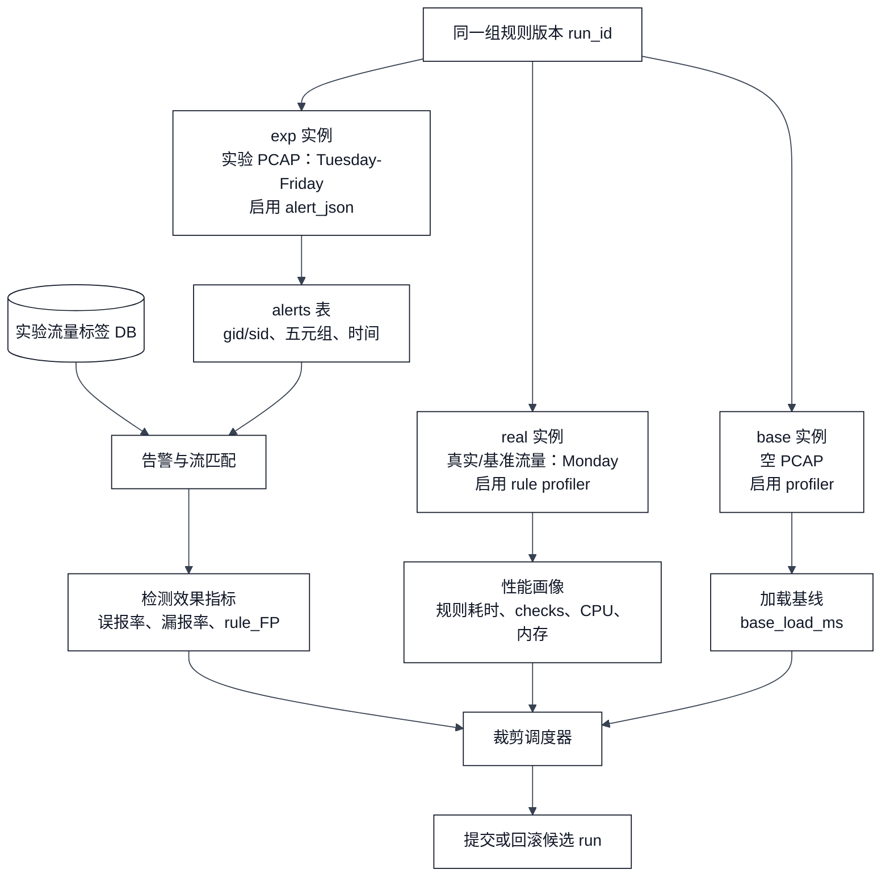

# 三实例评估模型图

```mermaid
%%{init: {"theme": "base", "themeVariables": {"background": "#ffffff", "primaryColor": "#ffffff", "primaryBorderColor": "#111827", "primaryTextColor": "#111827", "lineColor": "#374151", "secondaryColor": "#ffffff", "tertiaryColor": "#ffffff", "fontFamily": "Microsoft YaHei, Noto Sans CJK SC, SimHei, sans-serif"}}}%%
flowchart TB
    cfg[同一组规则版本 run_id] --> exp[exp 实例<br/>实验 PCAP：Tuesday-Friday<br/>启用 alert_json]
    cfg --> real[real 实例<br/>真实/基准流量：Monday<br/>启用 rule profiler]
    cfg --> base[base 实例<br/>空 PCAP<br/>启用 profiler]

    labels[(实验流量标签 DB)] --> match[告警与流匹配]
    exp --> alerts[alerts 表<br/>gid/sid、五元组、时间]
    alerts --> match
    match --> effect[检测效果指标<br/>误报率、漏报率、rule_FP]

    real --> cost[性能画像<br/>规则耗时、checks、CPU、内存]
    base --> load[加载基线<br/>base_load_ms]

    effect --> scheduler[裁剪调度器]
    cost --> scheduler
    load --> scheduler
    scheduler --> decision[提交或回滚候选 run]
```
