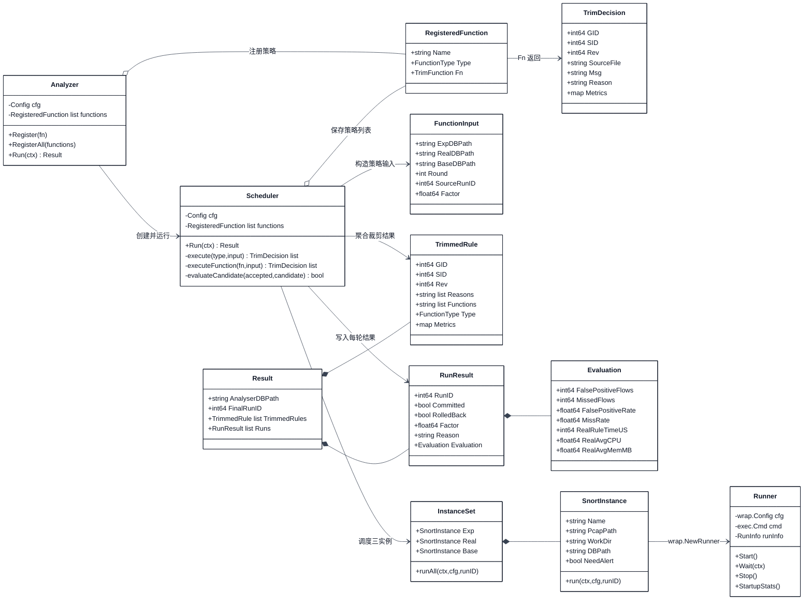

# 核心类与数据结构图

```mermaid
%%{init: {"theme": "base", "themeVariables": {"background": "#ffffff", "primaryColor": "#ffffff", "primaryBorderColor": "#111827", "primaryTextColor": "#111827", "lineColor": "#374151", "secondaryColor": "#ffffff", "tertiaryColor": "#ffffff", "fontFamily": "Microsoft YaHei, Noto Sans CJK SC, SimHei, sans-serif"}}}%%
classDiagram
    direction LR
    class Analyzer {
        -Config cfg
        -RegisteredFunction list functions
        +Register(fn)
        +RegisterAll(functions)
        +Run(ctx) Result
    }
    class Scheduler {
        -Config cfg
        -RegisteredFunction list functions
        +Run(ctx) Result
        -execute(type,input) TrimDecision list
        -executeFunction(fn,input) TrimDecision list
        -evaluateCandidate(accepted,candidate) bool
    }
    class RegisteredFunction {
        +string Name
        +FunctionType Type
        +TrimFunction Fn
    }
    class FunctionInput {
        +string ExpDBPath
        +string RealDBPath
        +string BaseDBPath
        +int Round
        +int64 SourceRunID
        +float64 Factor
    }
    class TrimDecision {
        +int64 GID
        +int64 SID
        +int64 Rev
        +string SourceFile
        +string Msg
        +string Reason
        +map Metrics
    }
    class TrimmedRule {
        +int64 GID
        +int64 SID
        +int64 Rev
        +string list Reasons
        +string list Functions
        +FunctionType Type
        +map Metrics
    }
    class RunResult {
        +int64 RunID
        +bool Committed
        +bool RolledBack
        +float64 Factor
        +string Reason
        +Evaluation Evaluation
    }
    class Evaluation {
        +int64 FalsePositiveFlows
        +int64 MissedFlows
        +float64 FalsePositiveRate
        +float64 MissRate
        +int64 RealRuleTimeUS
        +float64 RealAvgCPU
        +float64 RealAvgMemMB
    }
    class Result {
        +string AnalyserDBPath
        +int64 FinalRunID
        +TrimmedRule list TrimmedRules
        +RunResult list Runs
    }
    class InstanceSet {
        +SnortInstance Exp
        +SnortInstance Real
        +SnortInstance Base
        +runAll(ctx,cfg,runID)
    }
    class SnortInstance {
        +string Name
        +string PcapPath
        +string WorkDir
        +string DBPath
        +bool NeedAlert
        +run(ctx,cfg,runID)
    }
    class Runner {
        -wrap.Config cfg
        -exec.Cmd cmd
        -RunInfo runInfo
        +Start()
        +Wait(ctx)
        +Stop()
        +StartupStats()
    }

    Analyzer o-- RegisteredFunction : 注册策略
    Analyzer --> Scheduler : 创建并运行
    Scheduler o-- RegisteredFunction : 保存策略列表
    Scheduler --> FunctionInput : 构造策略输入
    RegisteredFunction --> TrimDecision : Fn 返回
    Scheduler --> TrimmedRule : 聚合裁剪结果
    Scheduler --> RunResult : 写入每轮结果
    RunResult *-- Evaluation
    Result *-- RunResult
    Result *-- TrimmedRule
    Scheduler --> InstanceSet : 调度三实例
    InstanceSet *-- SnortInstance
    SnortInstance --> Runner : wrap.NewRunner
```
