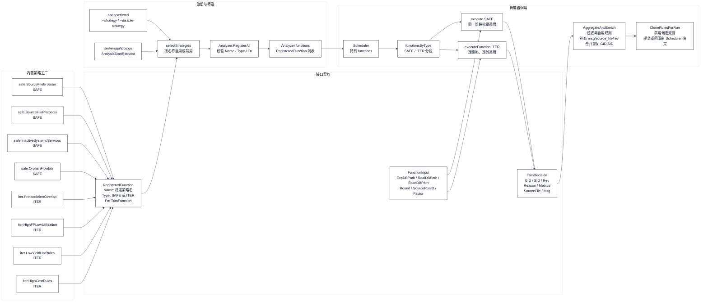

# 策略插件注册与调用图

```mermaid
%%{init: {"theme": "base", "themeVariables": {"background": "#ffffff", "primaryColor": "#ffffff", "primaryBorderColor": "#111827", "primaryTextColor": "#111827", "lineColor": "#374151", "secondaryColor": "#ffffff", "tertiaryColor": "#ffffff", "fontFamily": "Microsoft YaHei, Noto Sans CJK SC, SimHei, sans-serif"}}}%%
flowchart LR
    subgraph contracts[接口契约]
        registered[RegisteredFunction<br/>Name: 稳定策略名<br/>Type: SAFE 或 ITER<br/>Fn: TrimFunction]
        input[FunctionInput<br/>ExpDBPath / RealDBPath / BaseDBPath<br/>Round / SourceRunID / Factor]
        output[TrimDecision<br/>GID / SID / Rev<br/>Reason / Metrics<br/>SourceFile / Msg]
    end

    subgraph factories[内置策略工厂]
        safe1[safe.SourceFileBrowser<br/>SAFE]
        safe2[safe.SourceFileProtocols<br/>SAFE]
        safe3[safe.InactiveSystemdServices<br/>SAFE]
        safe4[safe.OrphanFlowbits<br/>SAFE]
        iter1[iter.ProtocolAlertOverlap<br/>ITER]
        iter2[iter.HighFPLowUtilization<br/>ITER]
        iter3[iter.LowYieldHotRules<br/>ITER]
        iter4[iter.HighCostRules<br/>ITER]
    end

    subgraph registry[注册与筛选]
        cli[analyser/cmd<br/>--strategy / --disable-strategy]
        api[server/api/jobs.go<br/>AnalysisStartRequest]
        select[selectStrategies<br/>按名称启用或禁用]
        register[Analyzer.RegisterAll<br/>校验 Name / Type / Fn]
        funcs[Analyzer.functions<br/>RegisteredFunction 列表]
    end

    subgraph dispatcher[调度器调用]
        scheduler[Scheduler<br/>持有 functions]
        split[functionsByType<br/>SAFE / ITER 分组]
        safeCall[execute SAFE<br/>同一阶段批量调用]
        iterCall[executeFunction ITER<br/>逐策略、逐轮调用]
        enrich[AggregateAndEnrich<br/>过滤非启用规则<br/>补充 msg/source_file/rev<br/>合并重复 GID:SID]
        apply[CloneRulesForRun<br/>禁用候选规则<br/>提交或回滚由 Scheduler 决定]
    end

    safe1 --> registered
    safe2 --> registered
    safe3 --> registered
    safe4 --> registered
    iter1 --> registered
    iter2 --> registered
    iter3 --> registered
    iter4 --> registered
    registered --> select
    cli --> select
    api --> select
    select --> register
    register --> funcs
    funcs --> scheduler
    scheduler --> split
    split --> safeCall
    split --> iterCall
    input --> safeCall
    input --> iterCall
    safeCall --> output
    iterCall --> output
    output --> enrich
    enrich --> apply
```
